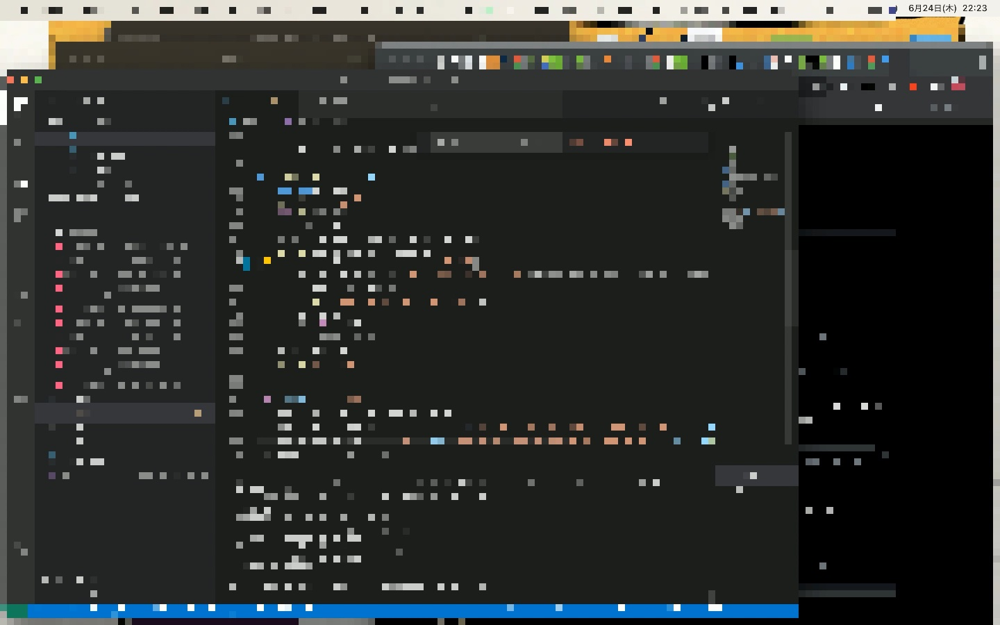

# MosaicedTimeLapse
Take a mosaicked time-lapse capture video of your desktop.
Use it to keep track of your progress and share it without leakage of personal information.
## Feature
- choose interval between shots
- set fps as you like
- choose the strength of mosaic
- set if exclude mosaic on clock(mac's upper left, 300x70)
- set if reduce size
- export in mp4(H264)

## Setup
`pipenv sync`
## How to Use
macのシステム環境設定でターミナルからの画面収録を許可してください
```
pipenv shell
python3  main.py
```
## execution checked environment
macOS 11.4
python 3.8.5

## TODO
- [x] take a time-lapse capture video
- [x] mosaic videos
- [x] exclude mosaic on the clock(Upper right)
- [] exclude mosaic on the self-selecting range
- [x] exporting in mp4
- [] Support for GUI
- [] exclude Desktop picture from video (for otaku...)

## memo
```
pipenv --python 3.8.5
pipenv shell
pipenv install ***
```
